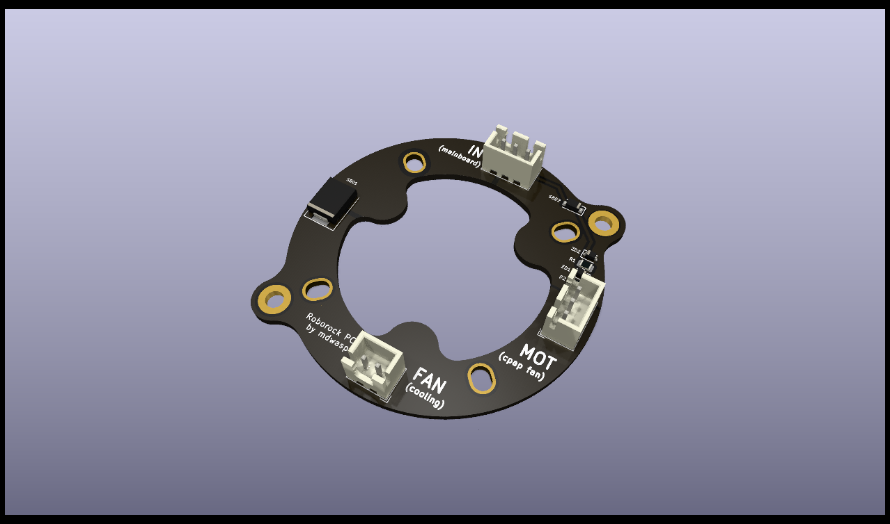
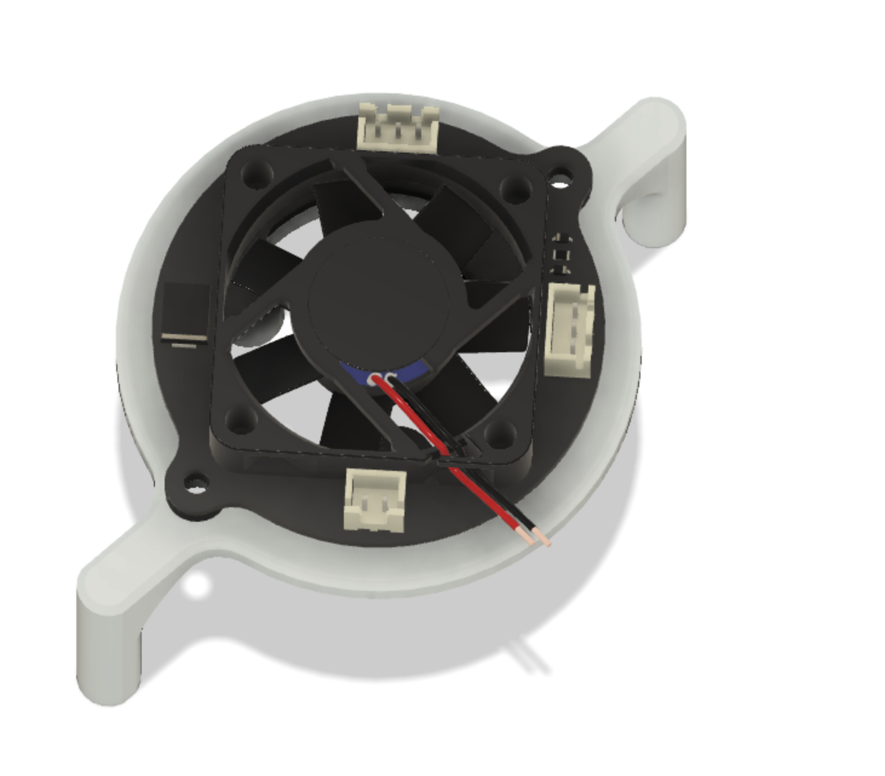
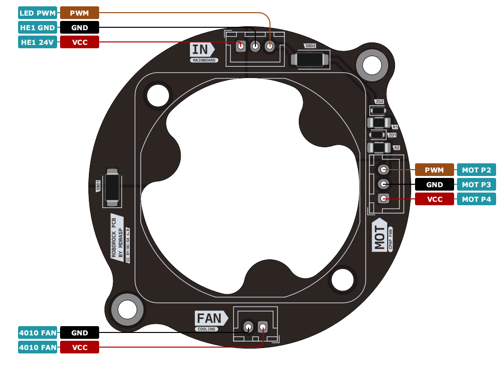

# Roborock CPAP PCB

[![CC BY-NC-SA 4.0][cc-by-nc-sa-shield]][cc-by-nc-sa]

This repository contains a custom PCB for use with the awesome work at [Roborock CPAP](https://github.com/condottab/Roborock-CPAP). The PCB shields the controller board from any back flow that might occur from the brushless controller.

The logic is the same as in the work of [stas2z](https://github.com/stas2z) but reshaped to better fit on the back of the blower while also allowing
for a cooling fan to be added.

## Assembly

## BOM

| Quantity | Designation    | Description          |
|----------|----------------|----------------------|
| 1        | SHOTTKY2       | SS34 Diode           |
| 2        | SHOTTKY1       | SS54 Diode           |
| 1        | ZENER1, ZENER2 | BZT52C5V1S Diode     |
| 1        | R2             | 1206 10kΩ resistor   |
| 1        | R1             | 1206 1kΩ resistor    |
| 2        | J1, J2         | JST XH 3P 2.54mm     |
| 1        | J3             | JST XH 2P 2.54mm     |
| 1        | -              | 4010 cooling fan 24V |
| 2        | -              | M3x6                 |
| 4        | -              | M3x12                |
| 4        | -              | M3 hex nut           |
| 4        | -              | M3 heat set insert   |

## Pinout

The pinout can also be found on the back side of your board and may be different from the most recent version (see note below). 

**Attention:**  
This motor pinout changed in version 0.2.0 due to a rotation of a connector. The same cables will work though since the connector has only been rotated. Refer to the writing on the back of your board.
In version 0.2.0, the 2 pin fan connector was labeled with switched GND and VCC.

## Ordering

In order to support this project, please consider ordering it through my affiliate link.

The gerber and BOM/CPL files can be found under `kicad/`.

## Mounting options

I have also developed some additional mounting options for the Roborock Fan:

* [VzBot 235](mounting/vzbot-235)
* more coming soon...

## Sponsors

The development of this board was kindly supported by [PCBWay](https://www.pcbway.com/) who sent me some prototypes of these boards free of charge.

## License

This work is licensed under a
[Creative Commons Attribution-NonCommercial-ShareAlike 4.0 International License][cc-by-nc-sa].

[![CC BY-NC-SA 4.0][cc-by-nc-sa-image]][cc-by-nc-sa]

[cc-by-nc-sa]: http://creativecommons.org/licenses/by-nc-sa/4.0/
[cc-by-nc-sa-image]: https://licensebuttons.net/l/by-nc-sa/4.0/88x31.png
[cc-by-nc-sa-shield]: https://img.shields.io/badge/License-CC%20BY--NC--SA%204.0-lightgrey.svg?style=for-the-badge
