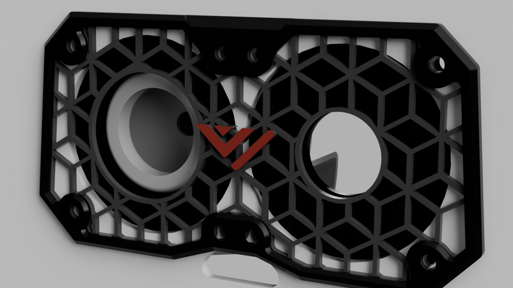
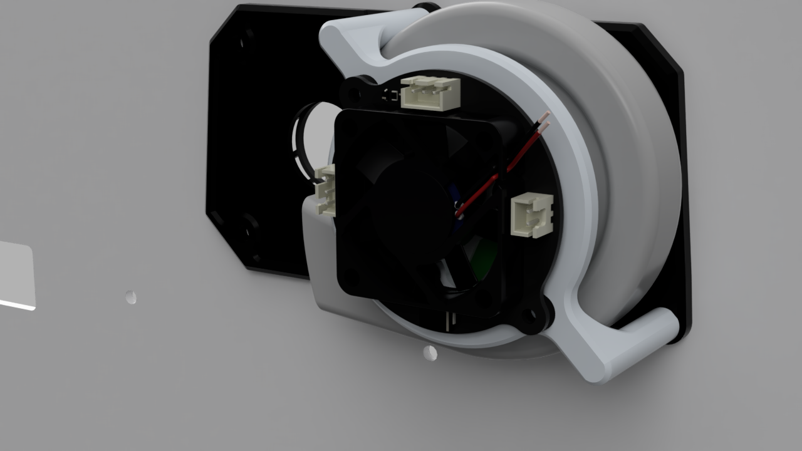

# VzBot 235 exhaust mounting

This repurposes the default exhaust cutouts in the backplate to hold your Roborock fan. One side is used for the intake, the other side passes through the hose.

## BOM

| Quantity | Description           |
|----------|-----------------------|
| 8        | M3x8 SHCS             |
| 8        | M3 heat set insert    |
| 2        | M3x6 SHCS             |
| 1        | Roborock Fan Assembly |

## Printing

Files can be found in [stls/](stls/)
